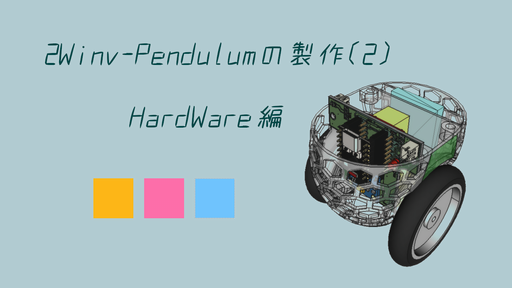

車輪型(2輪)倒立振子の製作

製作内容は、下記 youtube "2w mini inv pendulum Software Description" をご参照下さい。

https://www.youtube.com/watch?v=mnBo8ZFzsgw

ここは、製作動画中 "Practice3_IMU" の説明で使用した、ESP32-C3, MPU6050 を用いたジャイロ制御ソースのリポジトリとなります。

This is the repository for the gyro control source using ESP32-C3 and MPU6050,
 which was used in the explanation of "Practice3_IMU" in the production video.
